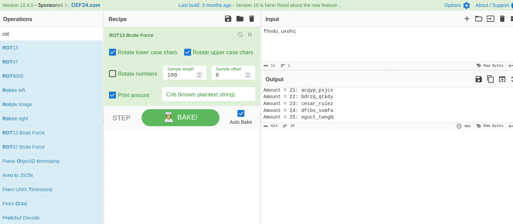

# Emperator Romano #

- **Tipo:** Cripto
- **Autor:** Specter@spectertj
- **Autor del Writeup:** [focab0r](https://github.com/focab0r)
- **Flag:** `flagHunters{cesar_rulez}`

### Descripcion ###

Este cifrado es tan basico que hay una ensalada en su nombre

fhvdu_uxohc

## WriteUp ##

La descripcion da la pista, se trata del cifrado Cesar, o ROT13. Con [Cyberchef](https://cyberchef.org), se puede utilizar la opcion `ROT13 Brute Force`, siendo el Amount 23 la flag.

