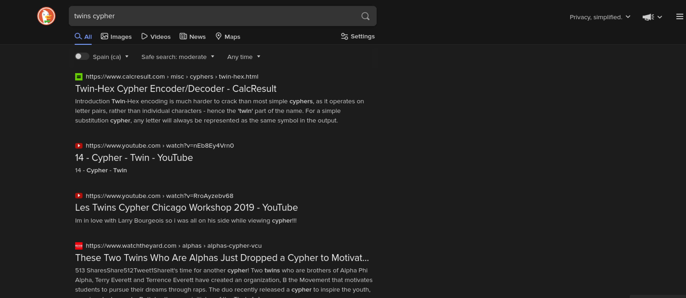
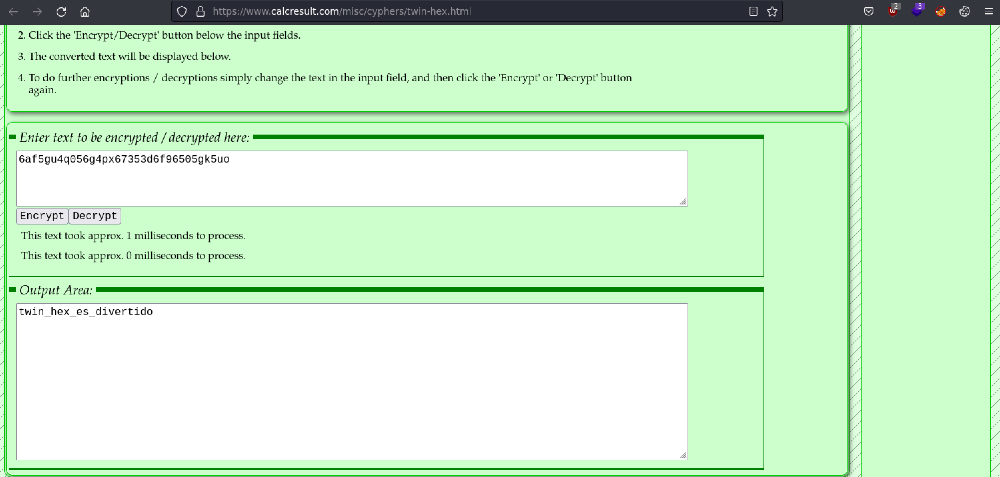

# Geminis #

- **Tipo:** Cripto
- **Autor:** Specter@spectertj
- **Autor del Writeup:** [focab0r](https://github.com/focab0r)
- **Flag:** `flagHunters{twin_hex_es_divertido}`

### Descripcion ###

¿Que es el signo del zodiaco geminis?

6af5gu4q056g4px67353d6f96505gk5uo

## WriteUp ##

La descripcion da la pista del reto: El signo del zodiaco de geminis son los gemelos, "twins" en ingles. Buscando `twins cypher` en [DuckDuckGo](https://duckduckgo.com), el primer resultado es un Twin-Hex decoder.

Simplemente insertando el texto cifrado y seleccionando desencriptar, obtenemos la flag.

