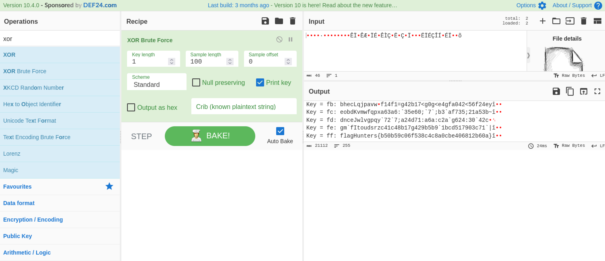

# Messing around 1 #

- **Tipo:** Cripto
- **Autor:** Gnunez@gnunez88
- **Autor del Writeup:** [focab0r](https://github.com/focab0r)
- **Flag:** `flagHunters{b50b59c06f538c4c8a0cbe406812b60a}`

### Descripcion ###

La que se puede liar con bits...

## WriteUp ##

Tras hace un `cat` al archivo, se ve un conjunto de bits aparentemente aleatorios. Haciendo un `file`, llegamos al siguiente resultado:
```
focab0r@arsenium:~$ file flag.enc

flag.enc: OpenPGP Public Key
```
Tras probar varias cosas con GPG, asumimos que se trata de un rabbit hole, y pasamos a buscar cifrados cuyo resultado sea textos en binarios. Aunque existen muchos, el mas famoso es XOR, que requiere una contraseña que no tenemos. Afortunadamente, [Cyberchef](https://cyberchef.org) tiene una opcion de fuerza bruta.

Para usarla, simplemente es necesario subir el binario, y seleccionar la opcion `XOR Brute Force`. La flag se encuentra con la contraseña `ff`:



