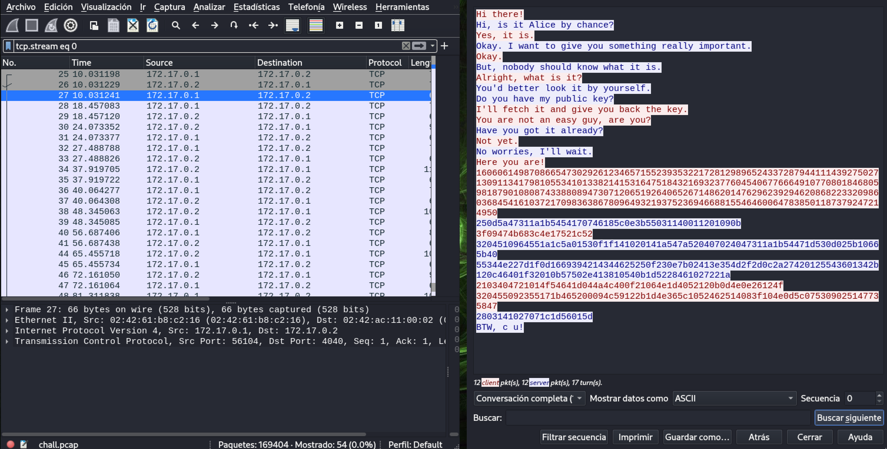
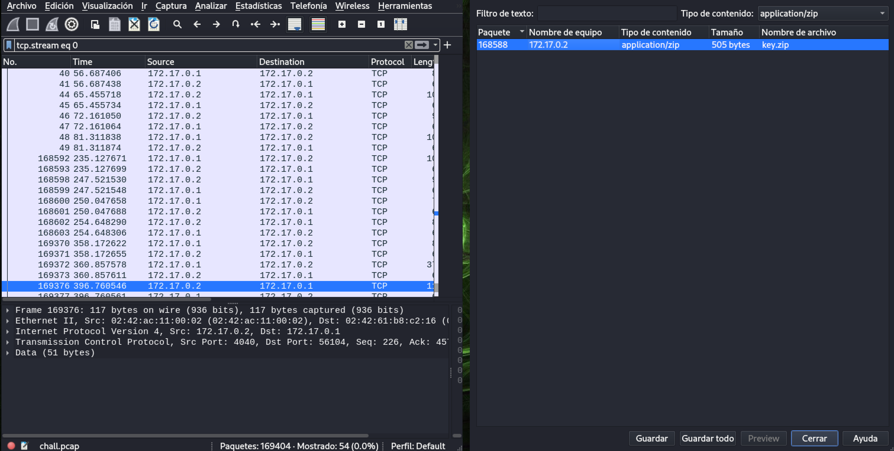
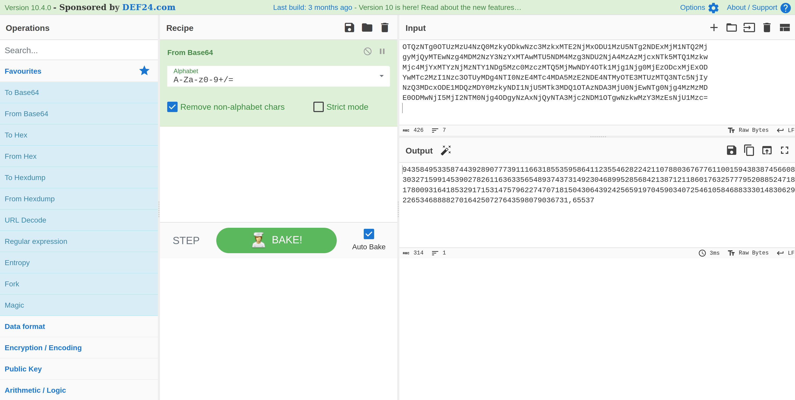
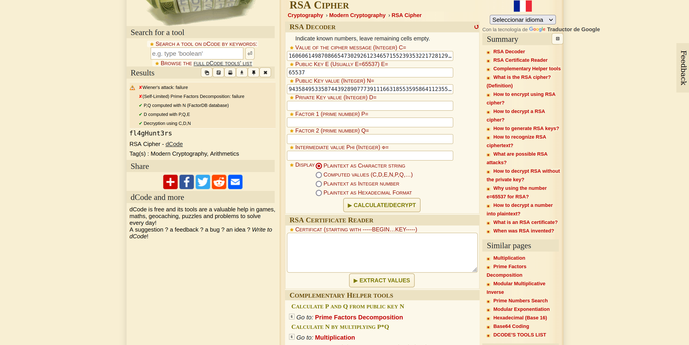
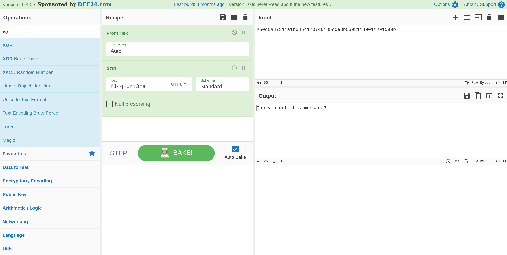
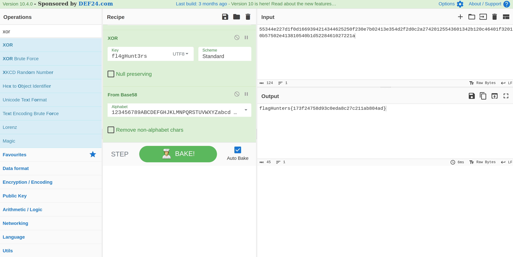

# 4n6 I #

- **Tipo:** Forense
- **Autor:** Gnunez@gnunez88
- **Autor del Writeup:** [focab0r](https://github.com/focab0r)
- **Flag:** `flagHunters{173f24758d93c0eda8c27c211ab804ad}`

### Descripcion ###

¿Qué tan seguro está vuestro secreto?

## WriteUp ##

El reto contiene un archivo ".pcap", es decir, paquetes de red capturados, y que se pueden ver mediante `Wireshark`.

Analizando las peticiones, vemos que se trata principalmente de un Fuzzing de directorios, intercalados con algunas peticiones `FTP` y `TCP`. Analizandolos, encontramos en las primeras lineas una conversación entre Alice y Bob, que empieza en el paquete 27. Para verla, seleccionamos el paquete y hacemos clic en `Seguir > Secuencia TCP`. El objetivo del reto parece claro: Bob va a compartir algo secreto a Alice (la flag), y para ello cifran los mensajes.



En base a los mensajes, podemos entender los siguientes datos:
- Bob tiene una llave publica.
- Alice tambien la tiene, pero la tiene que buscar.
- Una vez que la encuentra, cifra una clave con ella, y se la envia a Bob
- A partir de ahí, hablan con mensajes cifrados.

El objetivo primero, es, por tanto, conseguir la llave publica de Bob. Esta se puede encontrar entre los ultimos paquetes, ya que mientras un atacante esta haciendo fuzzing, llega a un archivo hosteado en el endpoint `/public/key.zip`. Otra forma de encontrarlo es mediante la busqueda de objetos: `Archivo > Exportar objetos > HTTP` (apareceran numeros archivos, pero ninguno existe, ya que se estaba realizando Fuzzing). Sin embargo, si seleccionamos el Tipo de contenido como `application/zip`, nos aparece el `key.zip`. Para descargarlo, unicamente es necesario seleccionarlo y guardarlo.



Al intentar abrir el ZIP, es necesario una contraseña.

### Obeniendo la llave ###

Otro archivo que llama la atencion se encuentra en el FTP. Seleccionando `Archivo > Exportar objetos > FTP-DATA`, vemos un `wordlist.txt`, que probablemente tendremos que utilizar para crackear el ZIP. Podemos descargarlo seleccionando guardar.

Para crackear el ZIP con `wordlist.txt`, podemos utilizar la herramienta `john`. Primero es necesario obtener el hash del archivo, y luego crackear el hash:
```
focab0r@arsenium:~$ zip2john key.zip > hash.txt

ver 2.0 efh 5455 efh 7875 key.zip/bob.pem PKZIP Encr: TS_chk, cmplen=325, decmplen=488, crc=C6260CA2 ts=AEC8 cs=aec8 type=8

focab0r@arsenium:~$ john hash.txt --wordlist=wordlists.txt

Using default input encoding: UTF-8
Loaded 1 password hash (PKZIP [32/64])
Will run 4 OpenMP threads
Press 'q' or Ctrl-C to abort, almost any other key for status
ZmxhZ0h1bnRlcnM= (key.zip/bob.pem)     
1g 0:00:00:00 DONE (2023-07-03 23:48) 12.50g/s 10035Kp/s 10035Kc/s 10035KC/s shante4..saleen02
Use the "--show" option to display all of the cracked passwords reliably
Session completed. 
```
La contraseña es `ZmxhZ0h1bnRlcnM=`, y se puede utilizar para leer el contenido de `bob.pem`.

### Descifrando los mensajes ###

Queda claro que el contenido del archivo se trata de la clave publica de Bob. Ademas, decodeandola en Base64, es posible ver que esta formada por dos valores separados por una coma: Un numero muy grande, y el valor `65537`. Se trata por tanto de RSA.



Por lo tanto, tenemos:
```
N = 94358495335874439289077739111663185535958641123554628224211078803676776110015943838745660830327159914539027826116363356548937437314923046899528568421387121186017632577795208852471817800931641853291715314757962274707181504306439242565919704590340725461058468833301483062922653468888270164250727643598079036731

e = 65537
```
Como tambien tenemos el mensaje cifrado, es decir el primer mensaje entre Alice y Bob, se puede tratar de atacar el RSA para comprobar si es debil y obtener el mensaje sin la clave privada. Esto se puede hacer mediante [dcode.fr](https://www.dcode.fr/rsa-cipher), sabiendo que, ademas de los valores superiores, el mensaje cifrado es "C":
```
C = 16060614987086654730292612346571552393532217281298965243372879441114392750271309113417981055341013382141531647518432169323776045406776664910770801846805981879010808743388089473071206519264065267148620147629623929462086822332098603684541610372170983638678096493219375236946688155464600647838501187379247214950
```
Rellenando los datos en la pagina, el ataque se realiza con exito, y podemos leer el mensaje: `fl4gHunt3rs`.



El mensaje es una clave privada que utilizan Bob y Alice para comunicarse entre ellos. Ante todo, es necesario averiguar que metodo de cifrado estan usando. Lo primero, es darse cuenta que en los demas textos cifrados, unicamente apaecen numeros del 1 al 9 y de la "A" a la "F". Es por tanto, hexadecimal. El otro cifrado por excelencia con clave es XOR, asi que utilizando [Cyberchef](https://cyberchef.org) con la opcion `From Hex` y luego `XOR`, desciframos el primer mensaje. Ojo, es necesario seleccionar la contraseña como "UTF-8", ya que sino no es valida.



La flag esta en uno de los mensajes, pasandola despues por `Base58`.


