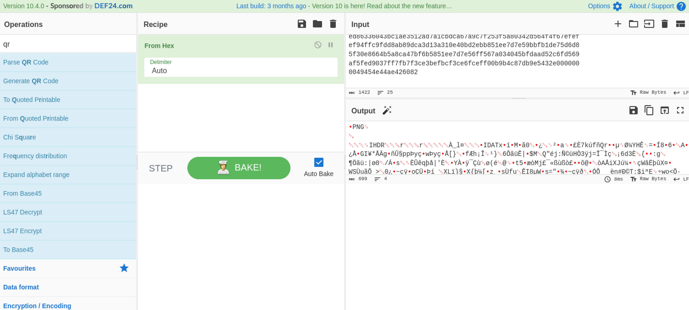
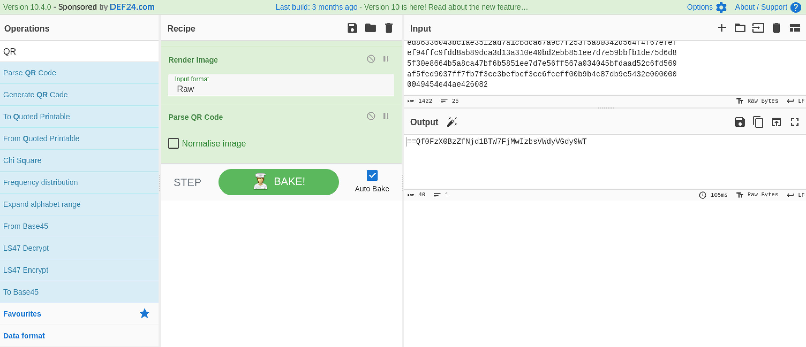

# ¡Que reverso! #

- **Tipo:** Misc
- **Autor:** Gnunez@gnunez88
- **Autor del Writeup:** [focab0r](https://github.com/focab0r)
- **Flag:** `Morteruelo2021{Y0uv3_g0t_1t}`

### Descripcion ###

El camino se hace paso a paso. Un solo paso no es caminar.

## WriteUp ##

El reto consiste en varias filas de numeros letras, que hay que decodear. Como solo incluye numeros del 1 al 9, y letras de la "A" a la "F", es muy probable que sea hexadecimal. Para decodearlo, se puede usar [Cyberchef](https://cyberchef.org), y seleccionar la opcion `From Hex`:



El resultado es una imagen, ya que en la primera parte del codigo binario se encuentra la palabra "PNG". Utilizando ahora la opcion `Render Image`, Cyberchef renderiza un codigo QR, que podemos leer usando la opcion `Parse QR Code`.



El texto devuelto es un string encodeado. 
```
==Qf0FzX0BzZfNjd1BTW7FjMwIzbsVWdyVGdy9WT
```
Su seña mas caracteristica es que empieza con dos signos "==", caracteristica que comparte con el encodeado `base64`, a diferencia de que este los tiene al final. Tras probar con varios cifrados que no funcionan, es logico suponer que la cadena esta invertida, y luego encodeada en `base64`. Para invertirla, se puede utilizar cualquier pagina web, come [esta](https://wordconvert.net/pt/turnText/), siendo la nueva cadena:
```
TW9ydGVydWVsbzIwMjF7WTB1djNfZzB0XzF0fQ==
```
Tras aplicarle el `base64`, se obtiene la flag.
