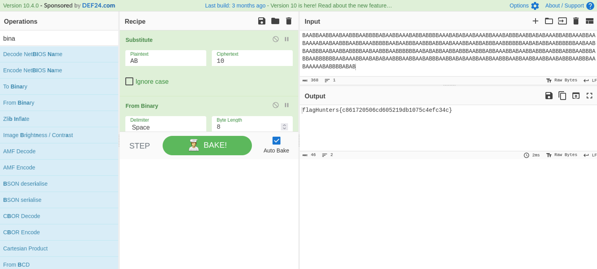

# Lo sabes bien 1 #

- **Tipo:** Stego
- **Autor:** Gnunez@gnunez88 
- **Autor del Writeup:** [focab0r](https://github.com/focab0r)
- **Flag:** `flagHunters{c861720506cd605219db1075c4efc34c}`

### Descripcion ###

There is a hidden message in plain sight

## WriteUp ##

El texto consiste en en una linea compuesta de "A"s y "B"s. Como el Bacon Decode no devuelve resultados, podemos probar a cambiarlas por "0"s y "1"s, pasando entonces a ser binario. Sustituyendo la "A" por un "1", y la "B" por un  "0", obtenemos un codigo en binario, que tras pasarlo por [Cyberchef](https://cyberchef.org) devuelve la flag.

