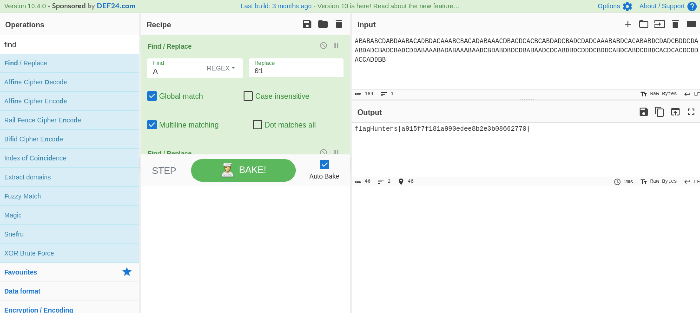

# Lo sabes bien 2 #

- **Tipo:** Stego
- **Autor:** Gnunez@gnunez88 
- **Autor del Writeup:** [focab0r](https://github.com/focab0r)
- **Flag:** `flagHunters{a915f7f181a990edee8b2e3b08662770}`

### Descripcion ###

There is a hidden message in plain sight

## WriteUp ##

Se trata de un reto similar al anterior, con la diferencia de que ahora son 4 letras. Con la misma logica, podemos suponer que las letras siguen un orden parecido al siguiente:
```
A --> 00
B --> 01
C --> 10
D --> 11
```
Como esa distribucion no funciona, podemos ir rotando los numeros, hasta encontrar los correctos:
```
A --> 01
B --> 10
C --> 11
D --> 00
```
Usando la funcion `find/replace` en [Cyberchef](https://cyberchef.org), y pasandolo a binario, obtenemos la flag.


