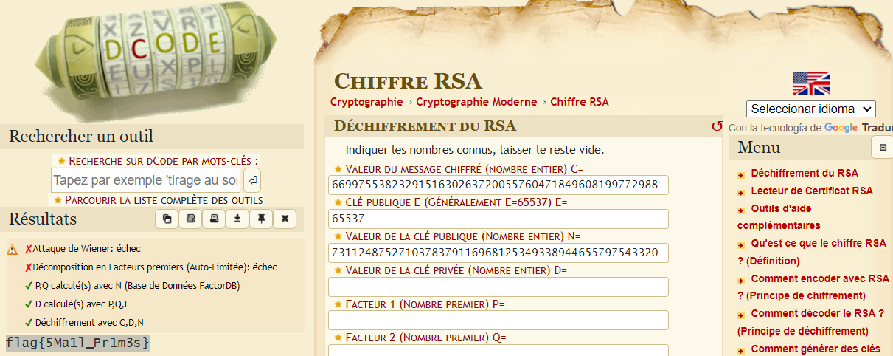

# crypto02 #
  
- **Tipo:** Criptografía 
- **Autor:** Deloitte
- **Autor del Writeup:** [dtorresss](https://github.com/dtorresss)
- **Flag:** `flag{5Ma1l_Pr1m3s}`

## WriteUp ## 

Al descomprimir el zip del reto nos encontramos con dos archivos. Uno de ellos el result.txt consta de varios parámetros que recuerdan a RSA. Al ver el siguiente archivo lo confirmamos ya que el archivo codifica y decodifica una fake flag usando RSA.

```

from Crypto.Util.number import getPrime, inverse, bytes_to_long, long_to_bytes, GCD

e = 65537 

while True:
    p = getPrime(100)
    q = getPrime(100)
    phi = (p -1 ) * (q-1)
    d = inverse(e,phi)
    if d != -1 and GCD(e, phi) == 1:
        break

n = p*q 

flag = b"flag{dummy_flag}"

plain_text=bytes_to_long(flag)

cypher_text = pow(plain_text,e,n)

print("n = ",n)
print("e = ",e)
print ("cyphertext =",cypher_text)


decrypt = (long_to_bytes(pow(cypher_text,d,n)))
```
Como tenemos n,e y el texto cifrado podemos servirnos de [dcodefr](https://www.dcode.fr/chiffre-rsa) para desencriptar el texto cifrado, consiguiendo la flag.


