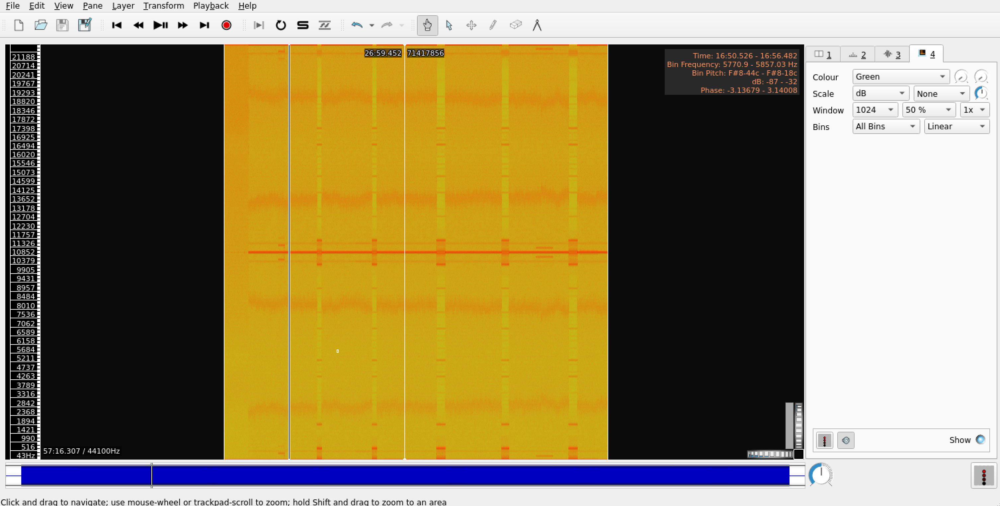
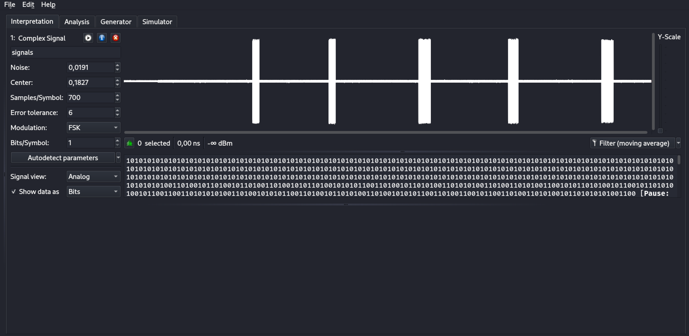
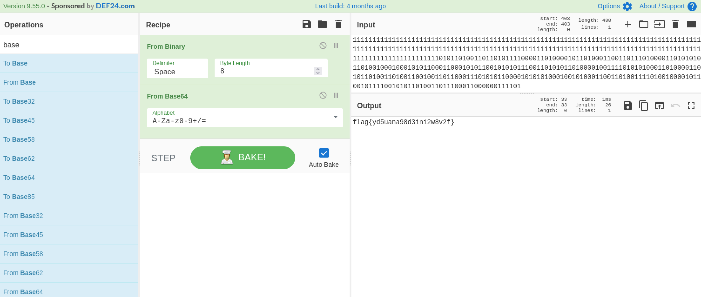

# radio01 #

- **Tipo:** Radio
- **Autor:** Deloitte
- **Autor del Writeup:** [focab0r](https://github.com/focab0r)
- **Flag:** `flag{yd5uana98d3ini2w8v2f}`

## WriteUp ##

Una breve visita por Internet nos permite saber que los archivos RAW contienen datos en bruto de otros programas, especialmente imagenes y audios. Como el reto se trata de "radio", utilizamos "Audacity" para abrir el archivo. Para ello, una vez en "Audacity", `Archivo > Importar > Datos en bruto...`

El audio no parece contener nada extraño, mas que una serie de ruidos. Para analizarlo mas a fondo, exportamos el archivo en formato `.wav`, y lo abrimos con `Sonic Visualiser`. Una vez alli, podemos utilizar la herramienta de analizado de Espectrograma, en `Layer > Add Spectogram`, obteniendo lo siguiente:

Es una señal de radio! Las lineas que se marcan sobre el fondo anaranjado, representan conjuntos de bits de datos. Estos se pueden extraer con la herramienta [Universal Radio Hacker](https://github.com/jopohl/urh). Para ello, se importa el RAW, y automaticamente "URH" muestra los datos extraidos de 5 señales.

Sin embargo, los datos parecen codificados, ya que "Cyberchef" no es capaz de mostrar ningun tipo de encriptacion valido. 

### Decodificando la señal ###

Uno de los protocolos de encriptacion mas utilizados en radio es el codigo de Manchester. Para decodear las señales en la pagina [dcode.fr](https://www.dcode.fr/manchester-code), vamos copiando cada señal por separado, y descifrandola. Pasandola despues por Cyberchef (From Binary), dos de las señales contienen una flag falsa, mientras que las otras devuelven una cadena de texto. Decodificandolas en Base64, una de ellas es la flag.

