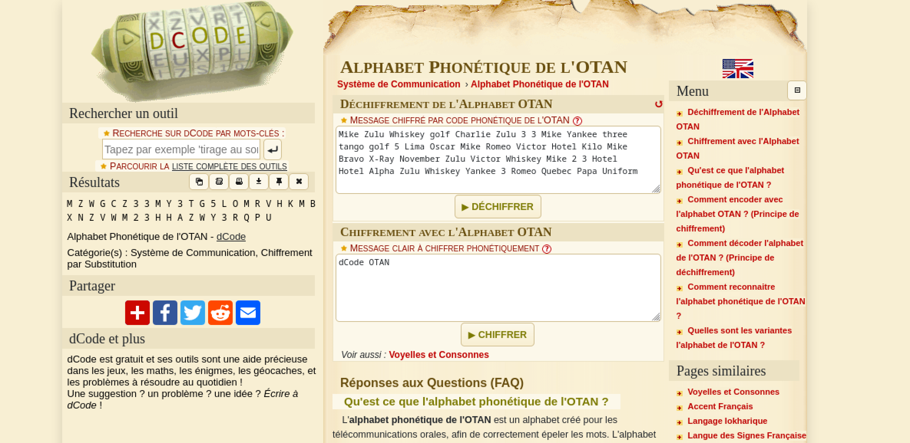
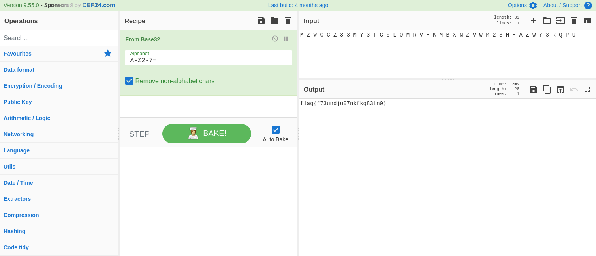

# radio02 #

- **Tipo:** Radio
- **Autor:** Deloitte
- **Autor del Writeup:** [focab0r](https://github.com/focab0r)
- **Flag:** `flag{f73undju07nkfkg83ln0}`

## WriteUp ##

Como "flag.zip" necesita contraseña, empezamos por "audio.wav". Escuchandolo, parece ser morse por lo que utilizamos una [pagina](https://morsecode.world/international/decoder/audio-decoder-adaptive.html) que permita decodearlo automaticamente, dando como reultado "PASSWORD:JGA@XU4ZZP8ZNK". La clave se utiliza para descomprimir el ZIP.

El audio "flag.wav" contiene una serie de palabras que parecen aleatorias. Utilizamos una [pagina](https://flixier.com/tools/convert-audio-to-text) para transcribirlas automaticamente, obteniendo:
```
Mike Zulu Whiskey golf Charlie Zulu 3 3 Mike Yankee three tango golf 5 Lima Oscar Mike Romeo Victor Hotel Kilo Mike Bravo X-Ray November Zulu Victor Whiskey Mike 2 3 Hotel Hotel Alpha Zulu Whiskey Yankee 3 Romeo Quebec Papa Uniform
```
Usando el detector de codigo de [dcode.fr](https://www.dcode.fr/identification-chiffrement), aparece como primer resultado el "Alfabeto fonetico de la OTAN". Decodeandolo en ese cifrado, obtenemos una nueva cadena de strings.



Probando la nueva cadena en [cyberchef](https://cyberchef.org) con diferentes formatos de encriptacion, Base32 devuelve la flag.


