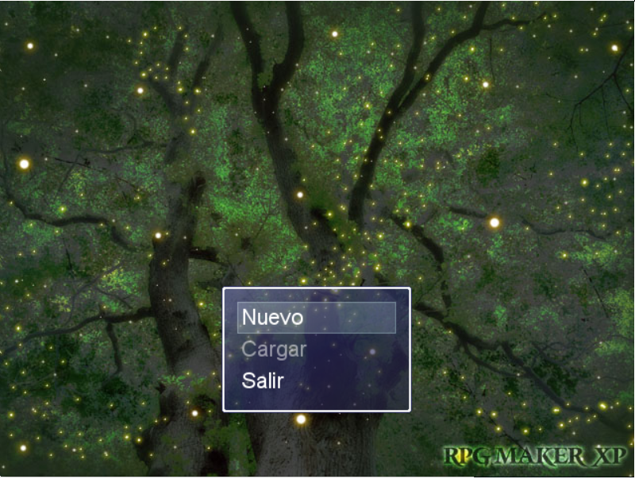
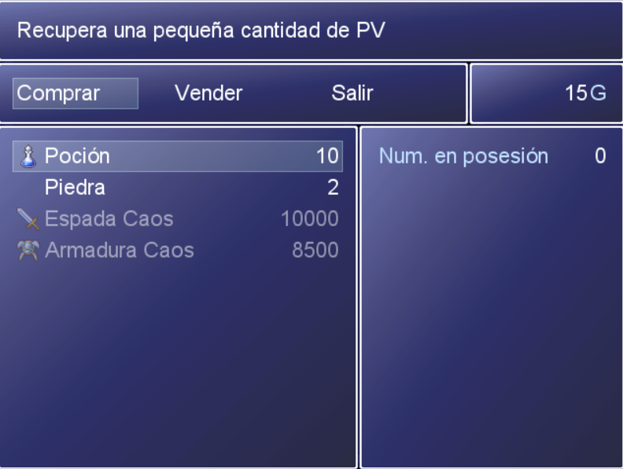
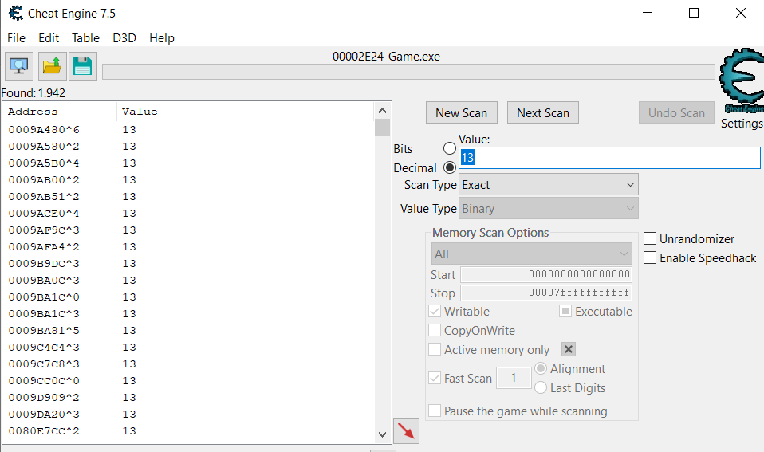
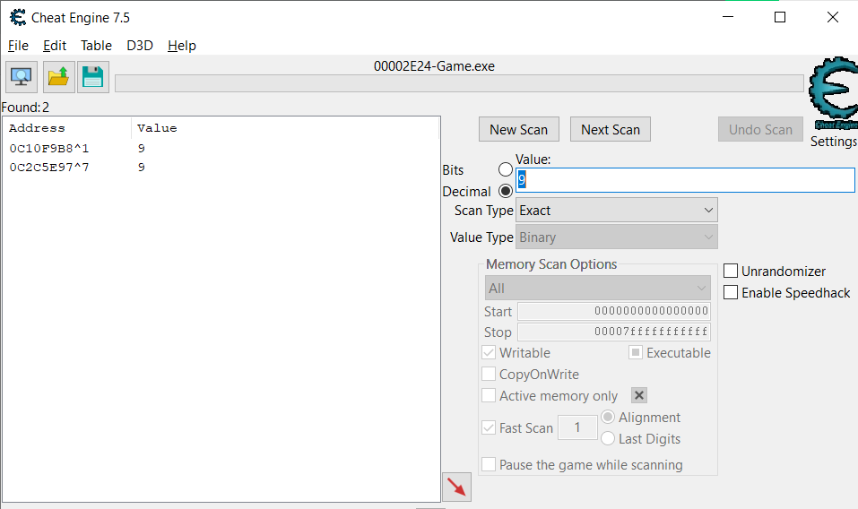
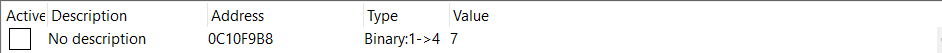
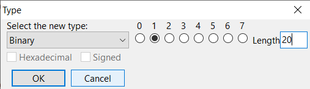
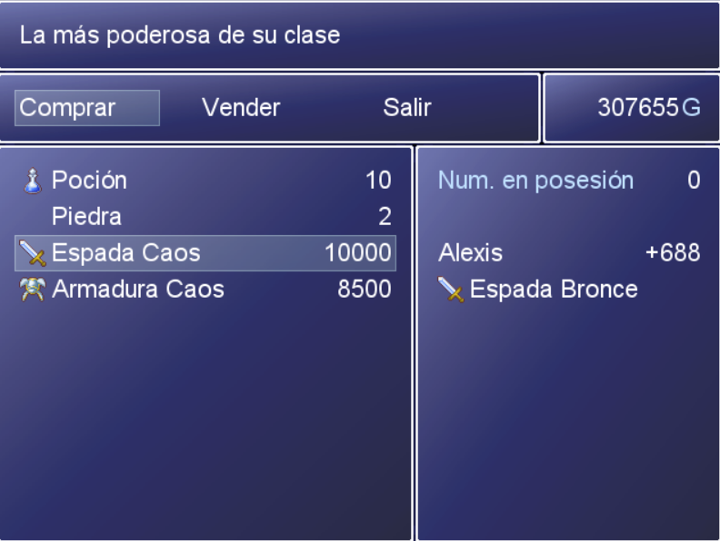
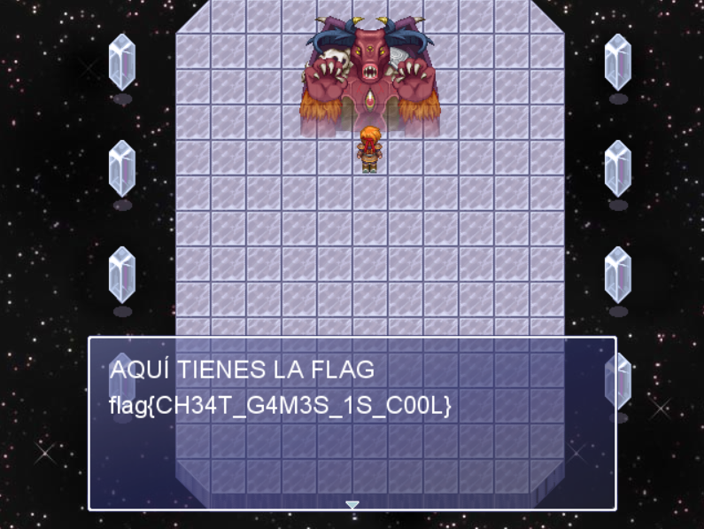

# rev02 #

- **Tipo:** Reversing / Game PWN
- **Autor:** Deloitte
- **Autor del Writeup:** [dtorresss](https://github.com/dtorresss)
- **Flag:** `flag{CH34T_G4M3S_1S_C00L}`

## WriteUp ##

Tras descomprimir el zip del reto nos encontramos, con varios archivos. Uno de ellos se trata de un exe. Si lo ejecutamos veremos que se trata de un pequeño juego.

Al empezar una partida, nos encontramos a un NPC que nos dará algo de dinero pero nos dice que si queremos derrotar al BOSS necesitaremos un mejor arma.
Al entrar en la tienda podemos ver que hay tres pestañas. Comprar, vender y salir.
Si entramos en el apartado de comprar podemos ver que hay varios objetos, pero solo podemos adquirir una pocion y una piedra ya que solamente tenemos 15 monedas.

Aparentemente intentemos lo que intentemos dentro del juego no se pueden aumentar las monedas para comprar la espada que queremos comprar.
Entonces va a ser necesario modificar el valor mediante un programa externo. En mi caso he usado [CheatEngine](https://www.cheatengine.org) ya que es de los mas conocidos.
A la hora de abrirlo necesitamos indicar el proceso que queremos monitorizar. Para ello hay que darle en la esquina superior izquierda al botón con el icono de la pantalla y elegir el juego.
Como queremos modificar la cantidad de monedas que tenemos debemos encontrar el address donde se almacena para poder cambiar su valor.
Podemos empezar haciendo un escaneo con el valor exacto de 15, ya que son las que tenemos.
Tras varias pruebas determiné que el valor era de tipo binario por lo que en los opciones se debe seleccionar esa opción.

Tras este escaneo podemos ver que aparecen unos 18 millones de resultados. Debemos ir ahora comprando cosas en la tienda para encontrar el address correcto.
Si compramos una piedra en la tienda que nos costara 2 monedas y buscamos por 13 ahora aparecen solamente 955 resultados.

Si repetimos otra vez esta operación aparecerán solamente 5 resultados. 

Entonces ahora si compramos una piedra más podemos ver en que registro el valor disminuye en dos y así descubriremos donde se aloja la cantidad de monedas que poseemos.
Una vez que lo hemos encontrado lo daremos doble click y bajará a la parte de abajo de la aplicación para poder modificarlo.

Se nos presenta un problema más. El tamaño del valor es de 4 por lo que solo podremos cambiarlo a como mucho 15. Pero tiene fácil solución ya que dando doble click sobre el campo Type podremos cambiar el Length. Realmente un valor superior a 10 debería bastar. En mi caso pondré 20.

Ahora podemos poner en el value un número mucho mayor. Elige uno mayor que lo que cuesta la espada. Ahora nos vamos al juego y si salimos de la tienda y volvemos a entrar podemos comprar la espada.

Por último la equipamos dandole al ESC para abir el menú y podemos seguir hacia delante para derrotar al boss.
Con la espada equipada si en el primer turno atacamos, le mataremos instantaneamente, consiguiendo la flag.

