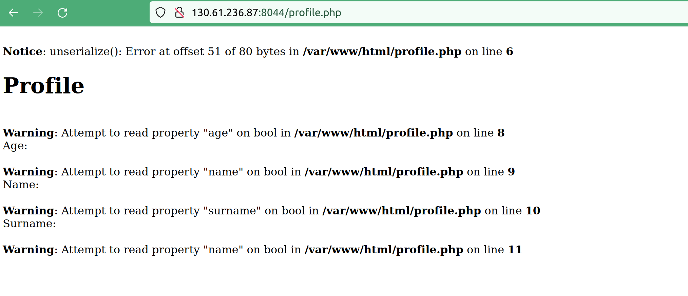

# Babyweb #

- **Tipo:** Web
- **Autor:** esquilichi
- **Autor del Writeup:** [focab0r](https://github.com/focab0r)
- **Flag:** `HackOn{y0u_kn0w_ab0ut_s3r1al1zie_1n_pHp!}`

### Descripcion ###

¿Podrás acceder como admin?

## WriteUp ##

Al entrar en la pagina Web, vemos un inicio de sesion, en el cual nos podemos registrar. Tal como dice la descripcion del reto, el objetivo es lograr entrar en la cuenta `admin`.

Si nos intentamos registrar como admin, vemos que se devuelve un mensaje de error, por lo que nos registramos con cualquier otro nombre, por ejemplo, `a`. El registro redirige a una pagina de perfil, la cual no da informacion relevante. Mirando las cookies, vemos que se nos ha asignado una. 

### Cookie Poisoning ###

La cookie se puede decodear mediante [cyberchef](https://cyberchef.org), seleccionando 'URL Decode'.

Si tratamos de modificar el valor de nombre por `admin`, y recargar la pagina, nos aparece un error, denominado 'Unserialize':

Buscando informacion por Internet, vemos que eso se debe a el numero que se encuentra entre "name" y "admin", en el cual pone un "1". Este numero es los caracteres que forman el nombre, y al cambiar la cookie a `admin`, y no variar el numero de caracteres a "5", la pagina devuelve un error.

Modificamos la cookie por el nuevo valor y recargamos la pagina.

La pagina devuelve la flag.
