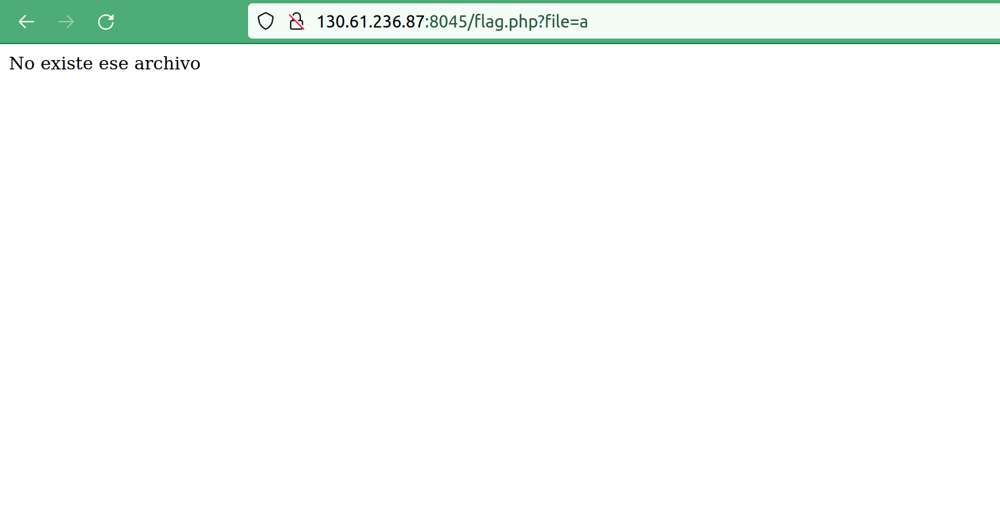
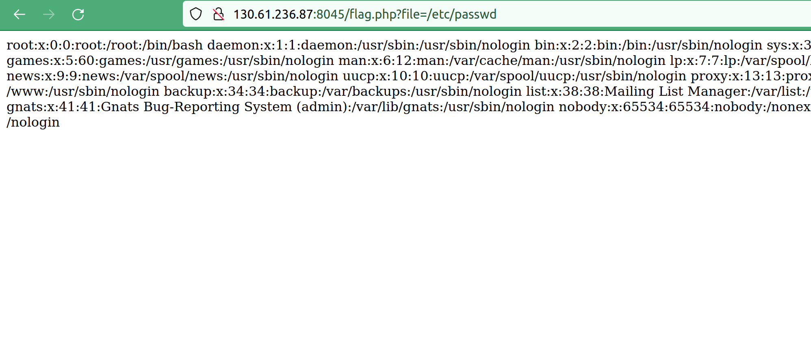
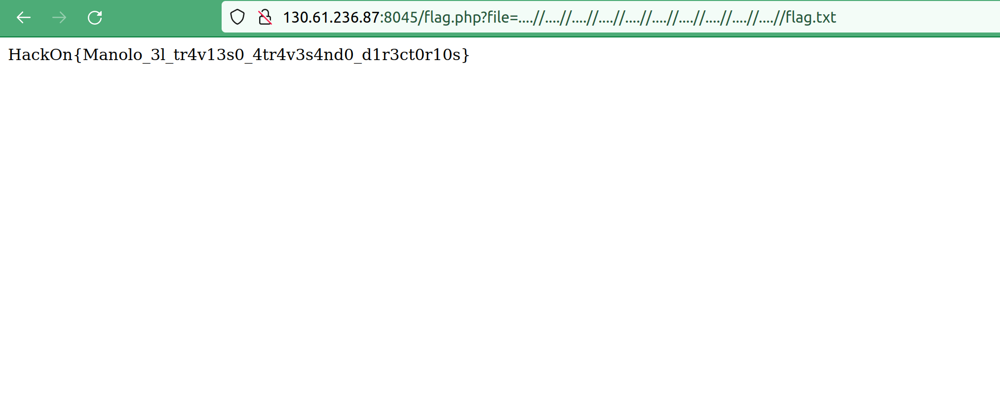

# Bar Manolo #

- **Tipo:** Web
- **Autor del Writeup:** [focab0r](https://github.com/focab0r)
- **Flag:** `HackOn{Manolo\_3l\_tr4v13s0\_4tr4v3s4nd0\_d1r3ct0r10s}`

### Descripcion ###

Tras la ruptura amorosa de Manolo Borracho y Paquito er Bayleis. Manolo ha decidido abrir un bar enfrente del Shawarma de Paquito.

Aun así, Manolo es muy travieso y le ha robado la flag a Paquito y y la ha escondido en la web de su bar.

## WriteUp ##
Al entrar en la pagina Web, vemos un input en el cual, al introducir una palabra, nos redirige al endpoint /flag.php



Fijandonos en la URL, se aprecia que existe un parametro "file" el cual se puede suponer que se utiliza para incluir archivos en la pagina. Por lo tanto, se trata de un Local File Inclusion (LFI). Esto se puede comprobar rapidamente accediendo a el archivo /etc/passwd, comun en todas las distribuciones de Linux. 



### Explotacion del LFI ###

Si accedemos al archivo flag.txt, nos devuelve un texto (`En este directorio no era :)`), con lo que se entiende que la flag se encuentra en otro directorio. Poniendo `../` delante de flag.txt, intentamos acceder a los directorios anteriores.
```
http://IP:PORT/flag.php?file=../../../../../../../../../flag.txt
```
Sin embargo, no parece que estemos accediendo a directorios diferentes, ya que el contenido no varia por muchos `../` que pongamos. Esto significa que por detras, el servidor esta sanitizando el input de alguna manera. 

Para bypassear el sanitizado, podemos probar algunos payloads de PayloadAllTheThings, del apartado de LFI. El mas conocido es `....//`, que permite evadir el filtrado de `'../' -> ''`. Con ese payload, y tras aplicar el sanitizado explicado anteriormente (si no es recursivo), se puede saltar las medidas de seguridad. 

Tras probarlo varias veces, terminamos llegando a la flag.
```
http://IP:PORT/flag.php?file=....//....//....//....//....//....//....//....//....//....//flag.txt
```

 
