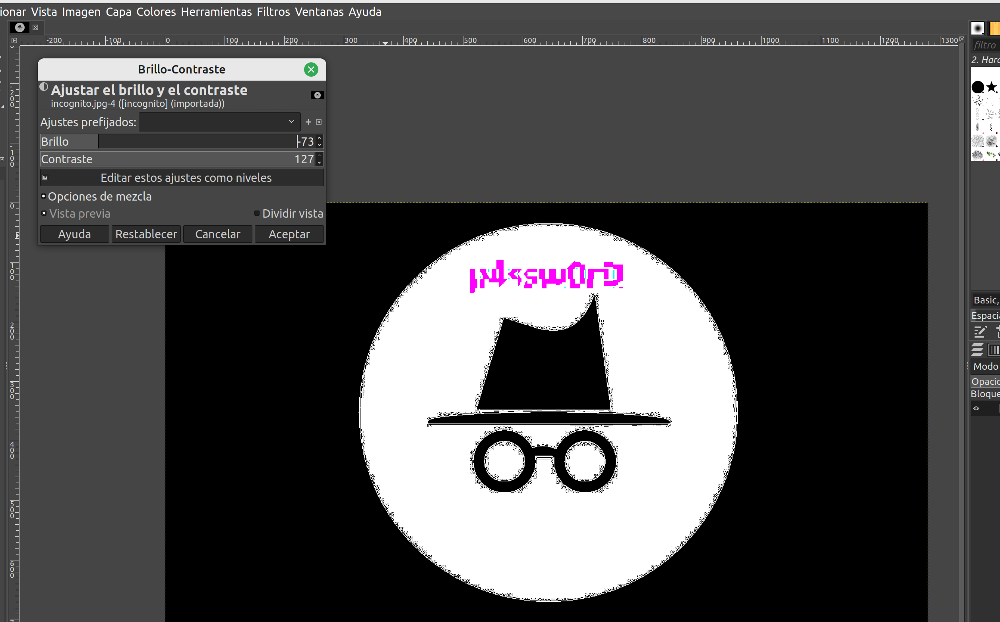

# Incognito #

- **Tipo:** Estego
- **Autor:** Ivan Gallego
- **Autor del Writeup:** [focab0r](https://github.com/focab0r)
- **Flag:** `HackOn{Una_Caja_Dentro_De_Una_Caja_Dentro_De_Una_Caja}`

### Descripcion ###

El otro día le pedí la contraseña del wifi a un amigo y me respondió con esto. No sé si me está vacilando o de verdad el tío guarda la contraseña en una imagen.

¿Puedes ayudarme a encontrar la contraseña?

## WriteUp ##

Tras comprobar los metadatos de la imagen y probar varias tecnicas de Esteganografia, abrimos la imagen con GIMP y jugamos con los controles de Brillo y Contraste bajo `Colores/Brillo-Contraste`, consiguiendo al final la contraseña "p4ssw0rD".



Esta tambien se puede conseguir mediante el uso automatizado de herramientas como `stegsolve`, las cuales permiten cambiar diferentes variables de colores para hallar posible texto escondido en las imagenes.

Despues de probar a introducir la contraseña como flag, intentamos utilizarla como salvoconducto de la herramienta `steghide`:
```
steghide extract -sf incognito.jpg
```
Se extrae un fichero llamado flag.txt, el cual contiene la flag.
