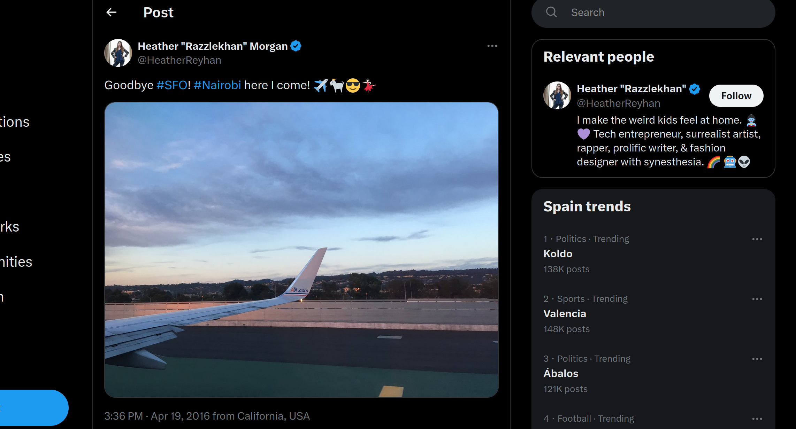

# $Bedouin$ #

- **Tipo:** OSINT
- **Autor del Writeup:** [focab0r](https://github.com/focab0r)
- **Flag:** `HackOn{SFO_NBO_HeatherReyhan_Razzlekhan}`

### Descripcion ###

There is a hacker on the loose!

She has stolen millions in bitcoin, we need your help to bring her to justice! In the scene of the crime there was only a piece of paper saying "Razz was here".

She uploaded a photo of a plane to one of her social media accounts a few months before the hack.

Your job is to figure out the origin and destination of said flight (using 3 letter airport code), the social media handle she uses (to this day) and her artistic name.

Flag format: HackOn{origin\_destination\_handle\_artisticname}

## WriteUp ##

Como la busqueda por imagen no devuelve ningun resultado, nos centramos en la frase "Razz was here". Una rapida busqueda en Internet ("razz bitcoin steal") devuelve varios resultados con el nombre de una rapera/influencer llamada Razzlekhan:

Tras leer su vida, cuadra perfectamente con el personaje que describe el enunciado, por lo que procedemos a enumerar sus redes sociales, en busca de la fotografia. Despues de visitar las publicas, donde no se encuentra nada, pasamos a las personales. En su [Twitter](https://twitter.com/HeatherReyhan), se puede encontrar la [imagen](https://twitter.com/HeatherReyhan/status/722418484529930244), publicada en el 2016. 

Ya solo queda buscar los aeropuertos de SFO y Nairobi, cuya sigla es NBO.
