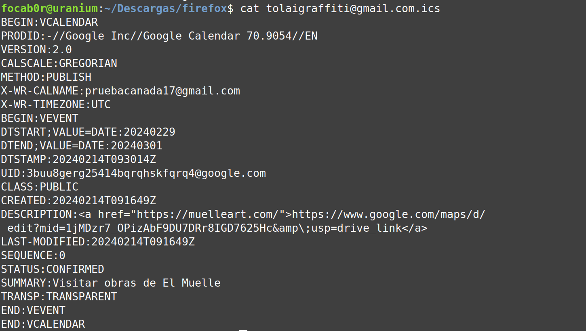
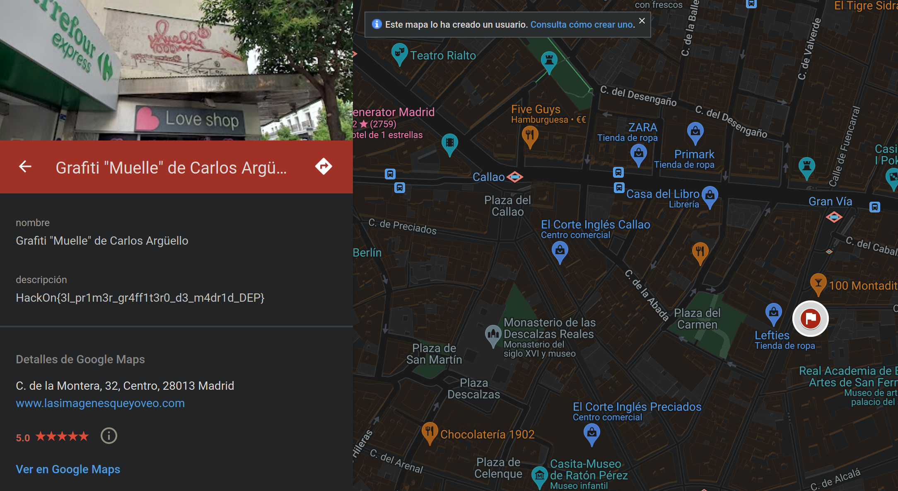

# El Muelle #

- **Tipo:** OSINT
- **Autor del Writeup:** [focab0r](https://github.com/focab0r)
- **Flag:** `HackOn{3l_pr1m3r_gr4ff1t3r0_d3_m4dr1d_DEP}`

### Descripcion ###

## WriteUp ##

Buscando el usuario en Internet, nos encontramos con una [cuenta de Twitter](https://twitter.com/tolaigraffiti), creada en Septiembre del 2024. En ella solo hay un QR, que si se escanea lleva a una pagina que ya no existe, pero que se puede buscar en la Wayback Machine. 

En la Wayback Machine, aparece otra [URL](https://drive.google.com/file/d/1xYE3XPeQda4iOdsAdAUQpNlCIexSPxCC/view?usp=sharing) que lleva a un Drive. De ahí nos descargamos un fichero, que es un calendario que se puede visualizar mediante el comando `cat`. 

Otro [enlace](https://www.google.com/maps/d/edit?mid=1jMDzr7_OPizAbF9DU7DRr8IGD7625Hc), esta vez de Google Maps, lleva a un mapa el que aparece la localización de un Grafiti. En la descripcion esta la flag.

