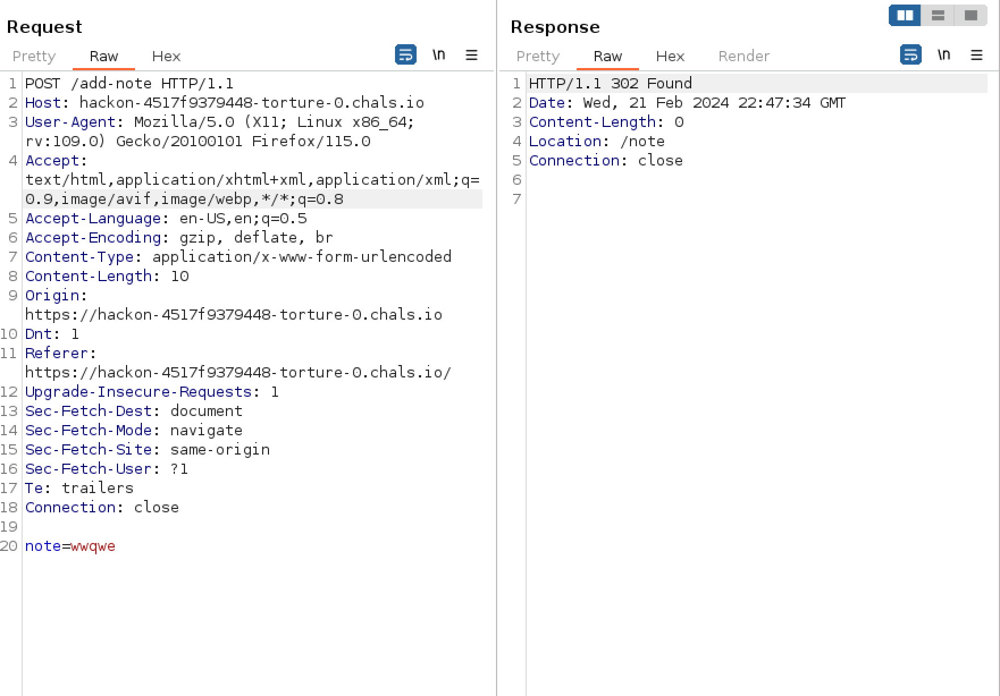
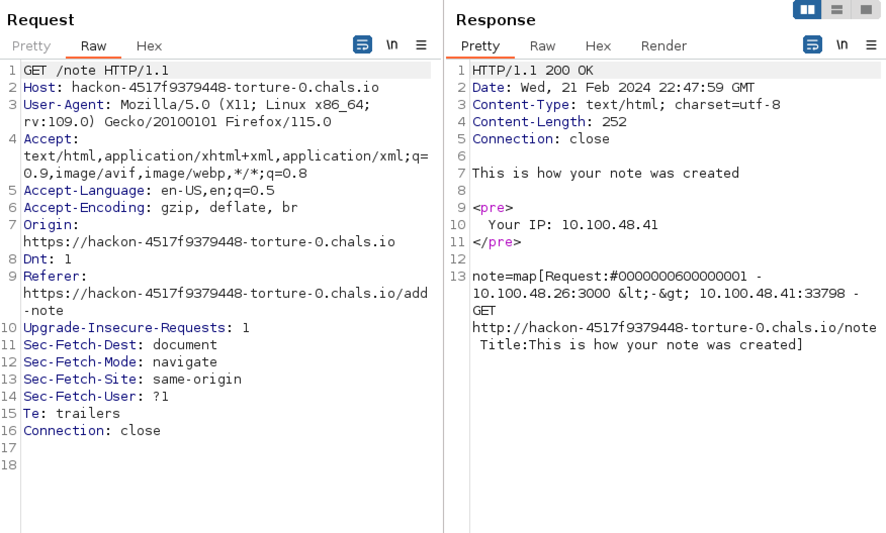
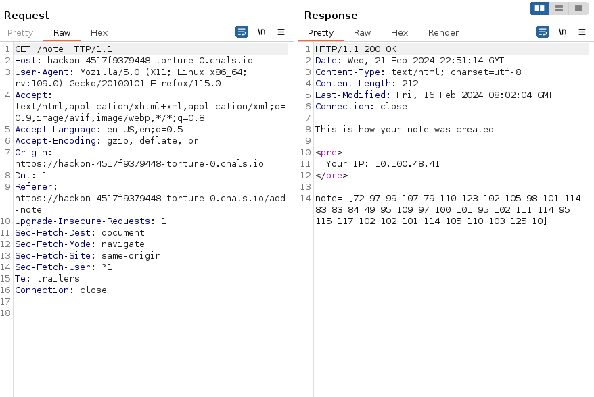
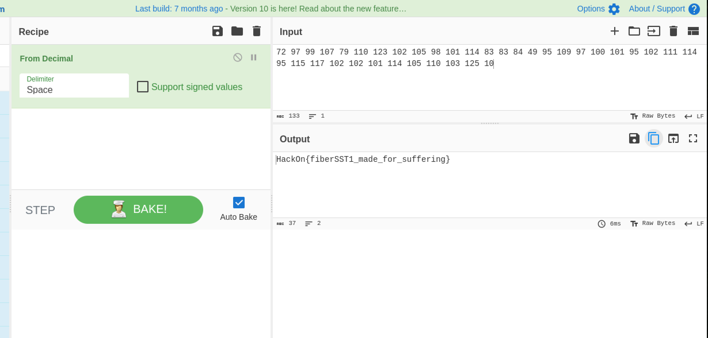

# ServerTortureTo{{owner}} #

- **Tipo:** Web
- **Autor del Writeup:** [focab0r](https://github.com/focab0r)
- **Flag:** `HackOn{fiberSST1_made_for_suffering}`

### Descripcion ###


## WriteUp ##

Al abrir el reto, se observa una pagina bastante sencilla, con un campo que muestra el contenido que se inserta en el. ¿SSTI?. Se puede comprobar facilmente: tras interceptar la peticion con Burpsuite, aparece un parametro que es el que lleva el contenido de la nota al servidor. Probar un SSTI es tan sencillo como introducir caracteres especiales, y comprobar si produce algun error.



Efectivamente, aparecen errores: la aplicacion es vulnerable a inyecciones de plantilla.

### Explotacion ###

La descripcion proporcionaba una buena pista del Framework que se ejecutaba en la maquina. Repetia mucho la palabra "Go", por lo que era sencillo pensar que probablemente estuviese escrito en Golang. Las sospechas se pueden confirmar con el payload `{{ . }}`, especifico de Go, que devuelve informacion de la aplicacion:



Una investigacion mas profunda y varias horas de documentacion, permiten descubrir que por debajo se ejecuta Fiber, un Framework de Go. En la seccion de la [API](https://docs.gofiber.io/api/ctx), se puede encontrar bastante informacion de como funciona, y de las peticiones que se pueden sacar. 

Los payloads mas basicos, como `{{ .Request.Download "flag.txt" }}` no funcionan, por lo que, tras una busqueda por Internet, se encuentra [esta pagina](https://payatu.com/blog/ssti-in-golang/) que contiene payloads de SSTI para Frameworks en Go. Anda, y esta Fiber.

El payload que se utiliza para leer archivos es `{{.Response.SendFile "/etc/hostname" }} {{ .Response.Body }}`. En nuestro caso, hay que adaptarlo ligeramente, ya que el metodo `Response` no esta accesible directamente desde `.`. Tras probar, vemos que se encuentras accesible desde `.Request`, siendo este el metodo que hallamos con el payload `{{ . }}`. La construccion del payload final es la siguiente:
```
{{ .Request.Response.SendFile "/flag.txt" }} {{ .Request.Response.Body }} 
``` 



La informacion es devuelta en ASCII, y se puede decodear en [Cyberchef](https://cyberchef.org).


