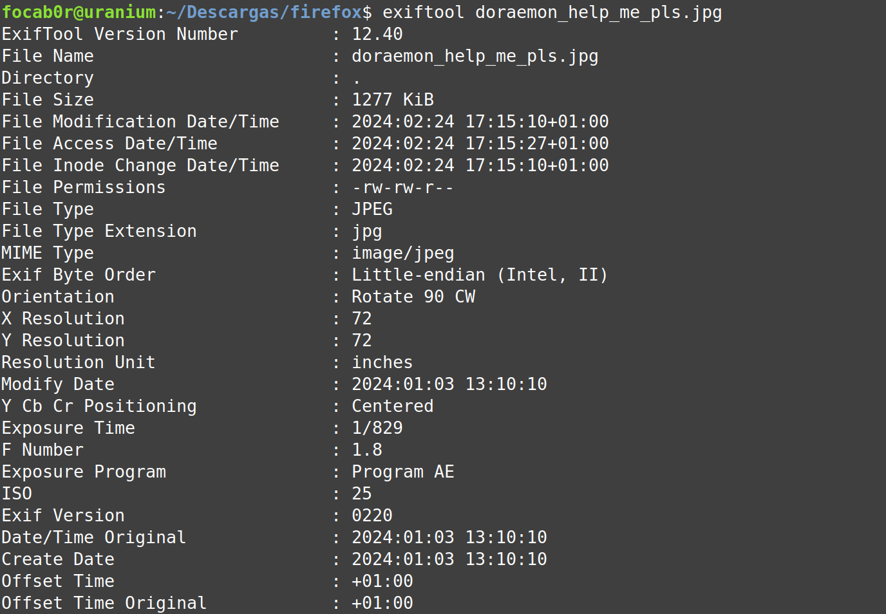
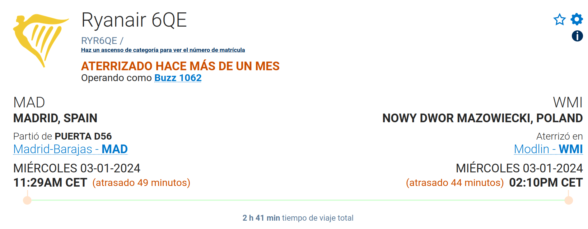

# The anywhere door #

- **Tipo:** OSINT
- **Autor del Writeup:** [focab0r](https://github.com/focab0r)
- **Flag:** `HackOn{MUC_RYR6QE_14:09}`

### Descripcion ###

Nobita needs help again. This time he got on the wrong flight on his way back from his vacation in Madrid. He was running out of battery, and rushed to send Doraemon a photo from the window. Nobita does not know where he is or how much flight time is left!

To be able to use the anywhere door, Doraemon has to know the airport from the photo (3 letter code), Nobita's flight code and the hour of arrival to the final unknown destination (the hour it actually arrived, not the expected hour)

Flag format: HackOn{AirportCode\_FlightCode\_ArrivalTimeCET}

## WriteUp ##

Una busqueda en Google Lens devuelve que se trata del Aeropuerto de Munich. Ademas, una revision de los metadatos de la imagen demuestra que el vuelo se llevo a cabo el 3 de Enero, a las 13:10:10.

Por lo tanto hay que buscar un [vuelo](https://airport-madrid.net/departure/timetable/date/2024010310) que salga de Madrid sobre las 10-11, cuyo rumbo pase por Munich. Uno de ellos es el vuelo Madrid - Varsovia (Warsaw), con el codigo RYR6QE. La informacion sobre el vuelo se puede buscar en esta [pagina](https://www.flightaware.com/live/flight/RYR6QE/history/20240103/0920Z/LEMD/EPMO), despues de registrarse.

A todo esto, hay que indicar que la fecha de llegada eran las 14:09 segun el reto, por lo que habia que restarle un minuto al tiempo de la pagina. Esto se podia ver comparando esa pagina con otras, y viendo que no todas coincidian.
